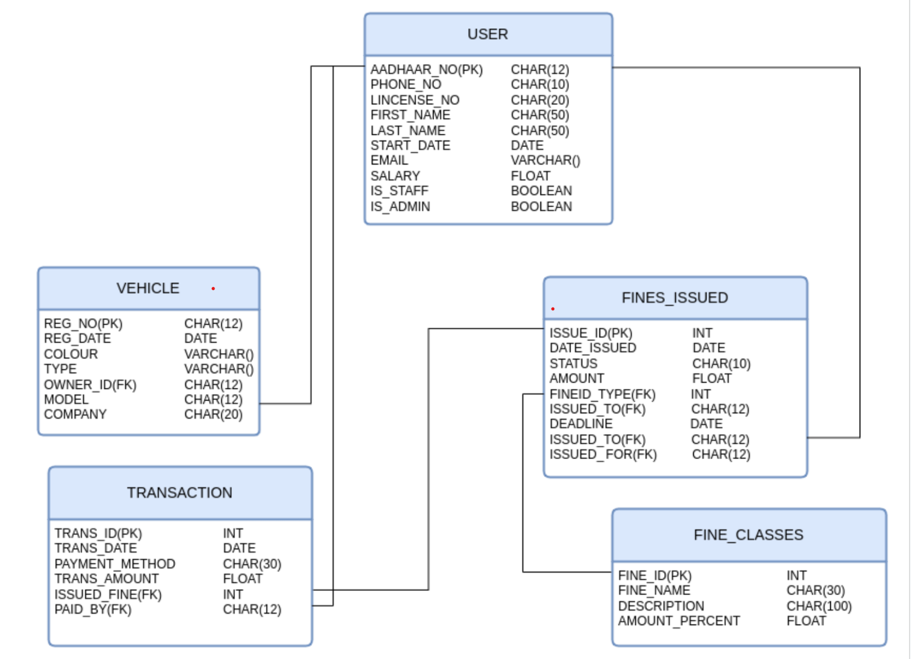

# TRAFFIC FINE MANAGEMENT SYSTEM
A Database Management System (DBMS) project designed for Semester 5, the Traffic Fine Management System (TFMS) efficiently tracks, manages, and processes traffic violation fines, ensuring streamlined record-keeping and effective penalty management as well as payment transactions of each user. Furethermore, the project offers an admin interface for a prospective admin panel to manage the entire database securely offering separate interface for the same

## TABLE OF CONTENTS
- [Overview](#overview)
- [Functionality](#functionality)
    - [User](#to-the-user)
    - [Admin](#to-the-admin)
- [Assumptions](#assumptions)
- [Constraints](#constraints)
- [Diagrams](#diargrams)
- [Authors](#authors)

## Overview
- The project is a prototype of a Traffic Fine Management System, created with the intent to streamline both user experience as well as administration by providing functionalities that cater to each user group.
- The project facilitates actions such as paying fines, requesting extensions, viewing transaction history, issuing fines (admin only), etc
- By offering an entirely separate user interface for both user and the admin, we are able to increase data security and cater each interface to the needs of the respective category of users

## Functionality
### To The User
**Authentication** - The user is able to login via their respective login pages. Permission based authentication is implemented to ensure users don’ t access details of other users, or the admin interface.

**Pay / extend a fine** - The user is able to pay fines that are issued to them via the user interface and in case they are unable to pay the fine before the deadline, they are entitled to ask for extension stating a valid reason.

**View Transactions** - Upon completion of each payment, the transaction history of each user is updated and the user is able to check the details and get a receipt of each of his transactions.

**Profile detaills** - The user is able to view his profile, including his private information and the vevhicles he own. He is also permitted to update certain details which will be reflected in the database.

### To The Admin
**Full Database Access** - The admin has complete control over the database and is free to modify any database as he/she pleases.

**Issue Fines** - The admin can issue fines to a particular individual and specify the type of fine to be issued. Each type of fine calculates the amount based on the user’s salary and sends it to the user.

**Create fine types** - The admin can add new types of fines as time goes on, ensuring that this prototype isn’t restricted entirely to today’s norms and can be utilized in the forever evolving world of transportation.

**Modify users and Permissions** - The ability to add new users rests solely in the hands of the admin, while the user is only permitted to change selected details. The admin can also give a user restricted access to the admin panel as a ‘staff’.

## Assumptions
1. The fine amount of each user is calculated based on the salary, due to which it is assumed that the salary of each user is defined and is a non zero value.
2. It is assumed that the admin is well versed in the functioning of the platform and that admin as well as the users possess an internet connectivity as the application works on a web interface
3. The data of each user is stored in the database and that the system has the storage capacity to cater to multiple users at once.

## Constraints
1. Administrative access is restricted to selected personell.
2. Each user has a unique ID in the form of their Aadhar number.
3. The password of each user and admin are hashed to ensure security and is not viewable or decodable by even the admin on his own.
4. Users are only allowed to view their own fine/transaction/profile details as well as update only these details.
5. There is no intermediary between the team delivering the database and the clients using them

## Diargrams
- ER Diagram

- Relational Schema

- Schema diagram

## Authors
- [Diljith P D](https://th3bossc.github.io/Portfolio/)
- [Abel Mani Roy](https://github.com/abelmaniroy/)
- [Sreeshma Sangesh](https://github.com/sreeshu123)
- [Anuj Suhas Haval](https://github.com/AnujHaval)
- [B Hemanth](https://github.com/BeerakamHemanth)
